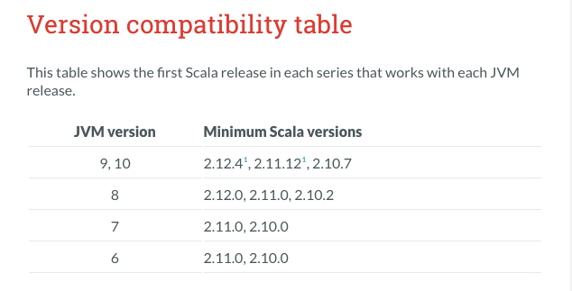
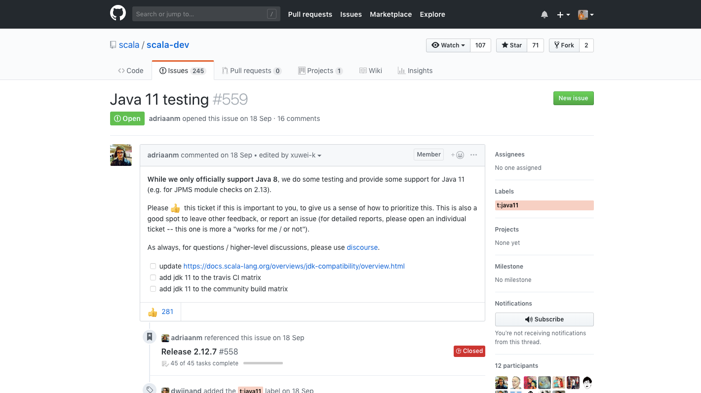
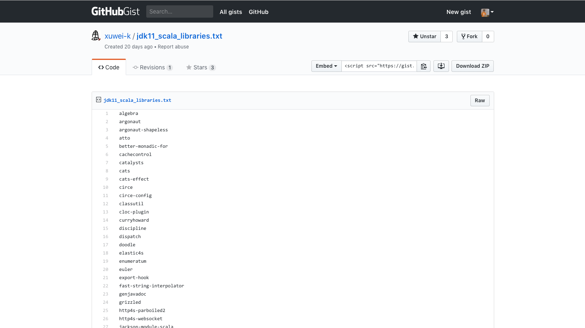
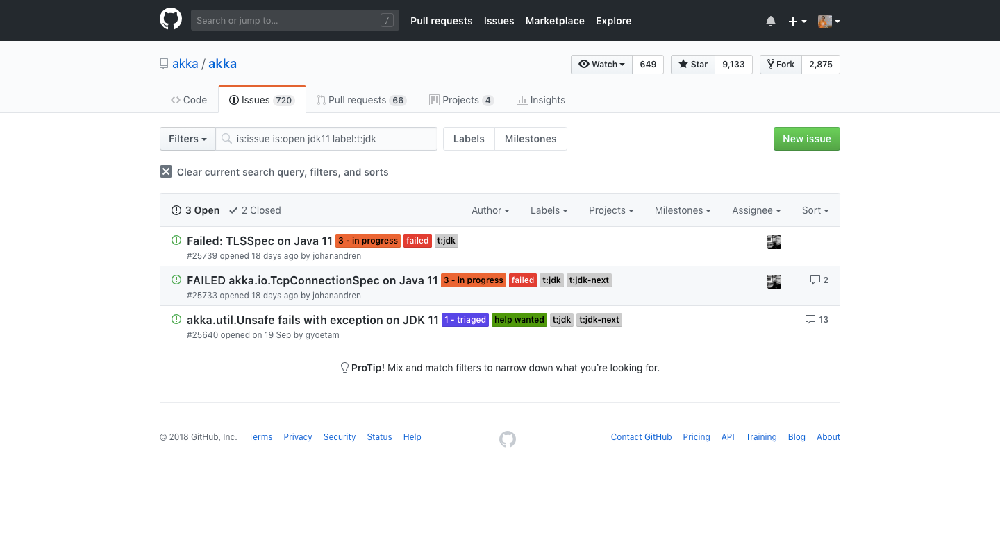
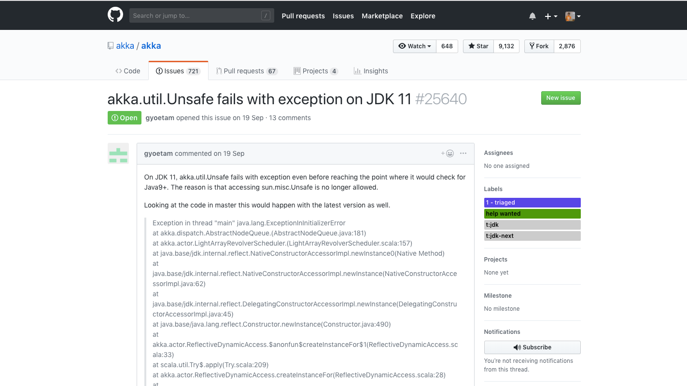
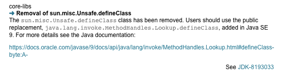
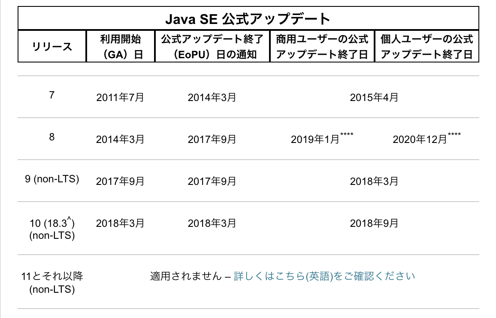
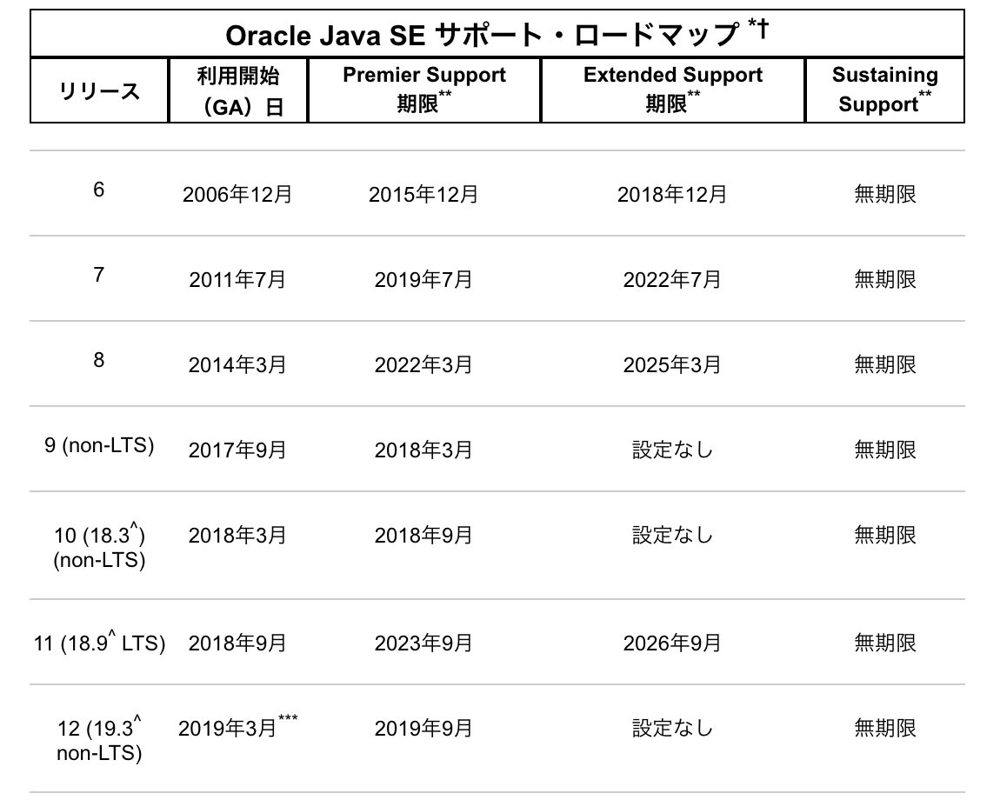
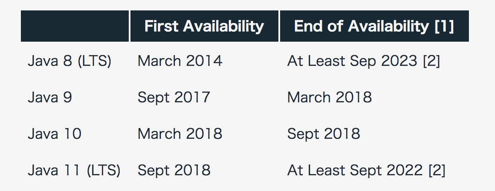
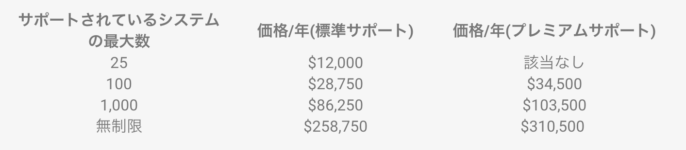

title: Scala製プロダクトのJava戦略
class: animation-fade
layout: true

<!-- This slide will serve as the base layout for all your slides -->
.bottom-bar[
{{title}}
]

---

class: impact

# .my-title[Scala製 プロダクトの Javaバージョン戦略]
#### 2018-10-24 Wed. @yoshiyoshifujii

---

# 自己紹介

.col-6[

- Yoshitaka Fujii [@yoshiyoshifujii](https://twitter.com/yoshiyoshifujii)
- ChatWork株式会社 (2ヶ月)
- Scala関西 Summit スタッフ
- Scala歴 4年
- Contributors of Akka
- [chatwork/akka-guard](https://github.com/chatwork/akka-guard)
- 🍣 🍶

]

.col-6[

.right[]

]

---

background-image: url(img/scala_ks.png)

.center[https://2018.scala-kansai.org/]

---

class: impact

.center[]

---

# Agenda

1. JDKの新しいリリース・モデル
2. ScalaのJava対応状況
3. 選択肢

---

class: middle

# JDKの新リリース・モデル

---

# JDKの新リリース・モデル

> オラクルは2017年9月、JDKの提供サイクルとライセンス方式に関して、新たなリリース・モデルを発表しました。
> これらはJDK 9より一部が適用され、2018年9月に公開予定のJDK 11で完全移行します。
> 新リリース・モデルはJDKの過去のリリース・モデルの課題を解決したものであり、ユーザーにより多くのメリットをもたらします。

.right[.small[https://www.oracle.com/technetwork/jp/articles/java/ja-topics/jdk-release-model-4487660-ja.html]]

---

.center[
<iframe src="//www.slideshare.net/slideshow/embed_code/key/14zC8niqVqAUuv" width="595" height="485" frameborder="0" marginwidth="0" marginheight="0" scrolling="no" style="border:1px solid #CCC; border-width:1px; margin-bottom:5px; max-width: 100%;" allowfullscreen> </iframe> 
 <strong> <a href="//www.slideshare.net/oracle4engineer/jdk-ver20" title="JDK: 新しいリリースモデル解説（ver.2.0）" target="_blank">JDK: 新しいリリースモデル解説（ver.2.0）</a> </strong> from <strong><a href="https://www.slideshare.net/oracle4engineer" target="_blank">オラクルエンジニア通信</a></strong> 

]

---

## 年6回の定期リリース・サイクル

- 新機能が追加される6カ月に1回のフィーチャー・リリース
  - 毎年3月、9月
  - 従来の「メジャー・リリース」という呼び名から
      - 新しく「フィーチャ－・リリース」に変更
  - JDKの正式なバージョン番号も上がっていく
  - JDKを短期間で定期的に更新していくことを重視したサイクル
  - 従来のように新バージョンで一挙に多数の機能が追加されるようなことはない
- 脆弱性対策などを施したアップデート・リリースを1年に4回
  - 毎年1月、4月、7月、10月

---

## 無償アップデートの終了時期と有償サポートの提供

- オラクルがビルドした公式OpenJDKバイナリは、新バージョンがリリースされたタイミングで旧バージョンの更新を終了
- 無償版を利用するユーザーは、新バージョンに移行することでJDKを引き続き無償で更新できる
- 特定バージョンでJDKの更新を継続したいユーザーには、JDK 11から3年ごとにLTS指定されるフィーチャー・リリースに対してOracle JDKバイナリを有償で提供

---

#### 1年に6回リリースされるオラクルの公式OpenJDKバイナリ

.center[]

---

#### オラクルの公式OpenJDKバイナリは6カ月でアップデートを終了

.center[]

---

# JDKの新リリース・モデル

> オラクルは2017年9月、JDKの提供サイクルとライセンス方式に関して、新たなリリース・モデルを発表しました。
> これらはJDK 9より一部が適用され、2018年9月に公開予定のJDK 11で完全移行します。
> 新リリース・モデルはJDKの過去のリリース・モデルの課題を解決したものであり、ユーザーにより多くのメリットをもたらします。

.right[.small[https://www.oracle.com/technetwork/jp/articles/java/ja-topics/jdk-release-model-4487660-ja.html]]

---

# JDKの新リリース・モデル

> オラクルは2017年9月、JDKの提供サイクルとライセンス方式に関して、新たなリリース・モデルを発表しました。
> これらはJDK 9より一部が適用され、2018年9月に公開予定のJDK 11で完全移行します。
> 新リリース・モデルはJDKの過去のリリース・モデルの課題を解決したものであり、ユーザーにより多くのメリットをもたらします。

.right[.small[https://www.oracle.com/technetwork/jp/articles/java/ja-topics/jdk-release-model-4487660-ja.html]]

--

<b style="color:red;font-size:100px;"> .center[もうはじまってる！]</b>

---

class: middle

# ScalaのJava対応状況

---

## ScalaのJava対応状況

.center[]

.right[.small[https://docs.scala-lang.org/overviews/jdk-compatibility/overview.html#version-compatibility-table]]

---

## ScalaのJava対応状況

.col-6[
> We recommend using Java 8 for compiling Scala code. Since the JVM is backward compatible, it is usually safe to use a newer JVM to run your code compiled by the Scala compiler for older JVM versions.
]

.col-6[
- コンパイルは Java 8 が推奨
- JVMは下位互換性があるため、新しいJVMを使用してScalaコンパイラによってコンパイルされたコードを古いJVMバージョン用に実行するのが通常安全です。
]

.right[.small[https://docs.scala-lang.org/overviews/jdk-compatibility/overview.html#running-versus-compiling]]

---

## ScalaのJava対応状況

.col-6[
.small[
> We try to provide experimental support for running the Scala compiler on LTS versions of Java (“Long Term Support”; see http://www.oracle.com/technetwork/java/eol-135779.html), and to the extent possible will include the current LTS Java version in our CI matrix and the community build. We will not, a priori, consider non-LTS Java versions. Compiler bugs related to Java versions other than the supported one (Java 8), will be scheduled with lower priority, and will not be considered release blockers. 
]
]

.col-6[
- ScalaコンパイラをLTSバージョンのJavaで実行するためのサポートを可能な限り提供しようとしている
- LTS以外のJavaバージョンは考慮しない
- サポートされているバージョン（Java 8）以外のJavaバージョンに関連するコンパイラのバグは、優先順位が低くスケジュールされる
]

.right[.small[https://docs.scala-lang.org/overviews/jdk-compatibility/overview.html#running-versus-compiling]]

---

## ScalaのJava11対応状況

.right[.small[https://github.com/scala/scala-dev/issues/559]]

.center[]

---

## ScalaライブラリのJava11対応状況

.right[.small[https://gist.github.com/xuwei-k/f0de6366f01363fbd25ada2c357508b5]]

.center[]

---

## AkkaのJava11対応状況

.right[.small[https://github.com/akka/akka/issues?q=is%3Aissue+is%3Aopen+jdk11+label%3At%3Ajdk]]

.center[]

---

## akka.util.Unsafeがコンパイルエラー

.right[.small[https://github.com/akka/akka/issues/25640]]

.center[]

---

## sun.misc.Unsafeが削除となった

.right[.small[https://www.oracle.com/technetwork/java/javase/11-relnote-issues-5012449.html#JDK-8193033]]

.center[]

---

# ScalaのJava対応状況-まとめ

.col-6[

- Java 8が推奨
- Java 9, 10は、Oracleのサポート終了
- Java 11は、絶賛テスト中
  - Akkaが動かないとかやばい
  - ライブラリもテスト中が多い

]

.col-6[

.middle[]

]

---

# ScalaのJava対応状況-まとめ

- いままで通り無償でやっていくなら、Java8
- ただし、2019年1月まで
- Java11にあげたいけど全部は動かない

---

class: middle

# 選択肢

---

# 選択肢

選択肢としては、

1. Oracle
2. AdoptOpenJDK
3. Azul Systems
4. IBM
5. Red Hat
6. 自前でがんばる

---

## Oracleの無償サポート

.col-6[

- Oracle JDKの公式アップデートは、Java8のみ残ってる
- それも、2019年1月(商用)まで
- カウントダウンは、はじまってる
- .small[https://www.oracle.com/technetwork/jp/java/eol-135779-ja.html]

]

.col-6[

]

---

## Oracleの有償サポート

.col-6[

- Premier SupportならJava8が2022年3月
- PC端末が月額1ユーザー2.5ドル
- サーバ／クラウドが月額1CPU25ドル
- 標準の契約期間は1年（2年および3年もあり）
- ボリュームディスカウントもあるらしい
- .small[https://www.oracle.com/technetwork/jp/java/eol-135779-ja.html]
- .small[https://www.oracle.com/technetwork/jp/java/javaseproducts/overview/javasesubscriptionfaq-4891443-ja.html]

]

.col-6[

]

---

## AdoptOpenJDK

.col-6[
- OpenJDKのビルドを提供するコミュニティ(無償)
- IBMなどがスポンサー
- LTSについては、4年間のサポート
- Java8について、2022年9月までサポート
- .small[https://adoptopenjdk.net/index.html]
]

.col-6[

]

---

## AdoptOpenJDK - 考察(私見も多いに含む)

- Oracleほどリリースが早くない
- 肌感覚として、1、2週間ほど遅れる
  - OpenJDKは、JDK 8u192 (2018/10/23現在)
  - AdoptOpenJDKは、JDK 8u181 (2018/10/23現在)
- あくまでベストエフォート
- コミュニティの要望が強いので早めに対応される期待はある
- 今までOracleJDKを使ってたなら、色々と検証はしておくべき
  - SSL証明書が不足して、httpsクライアントが失敗するとか

---

## Azul Systems

.col-6[
- Zulu(無償)
- Zulu Enterprise(有償)がある
- Java SE標準に完全準拠したOpenJDKの認証ビルド
- 10年間のエンタープライズグレードのJavaサポート
- .small[https://jp.azul.com/products/zulu-and-zulu-enterprise/]
]

.col-6[

]

---

## IBM

- Java SDKは2022年4月までJava8をサポート
- ただし、JVMがJ9
- .small[https://www.slideshare.net/takakiyo/jvmopenj9-vmibm-java]

---

## Red Hat

- Red Hat Enterprise Linux上のJDKをサポート
- OpenJDK8は、2023年6月まで
- .small[https://access.redhat.com/ja/articles/1457743]

---

## 自前でがんばる

- http://hg.openjdk.java.net/jdk8/jdk8/raw-file/tip/README-builds.html
- がんばれ!!

---

# まとめ

- Scalaは、Java8でコンパイル推奨
- 無償は、AdoptOpenJDKかな…
- 有償は、Azul or Oracle かな…
- みなさん、どうされるのか、情報交換させて欲しい!!

